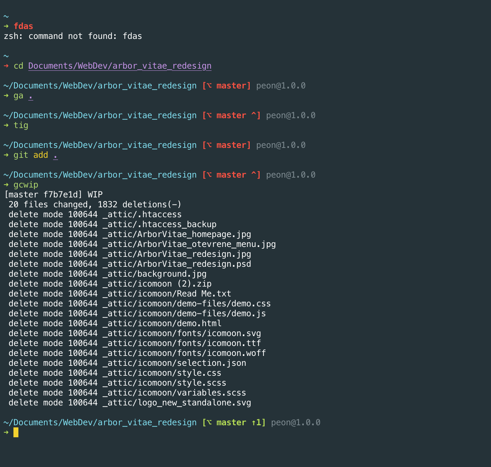

# shell_theme

My custom shell theme for zsh. Inspired mainly by [Spaceship theme](https://github.com/denysdovhan/spaceship-prompt) and bunch of other mostly unknown resources.

I have created this theme in my spare time to have something which suits me and is minimal as well. So do not expect too many customization for these reasons. I also wanted to create my own theme in order to learn more about shell and zsh.

How does it look like:

